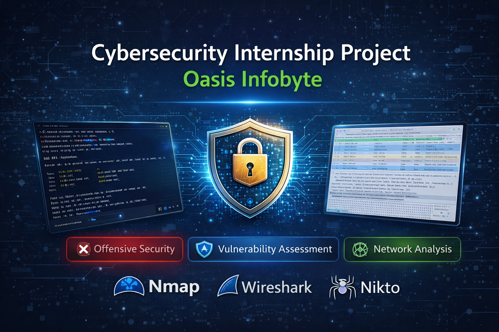
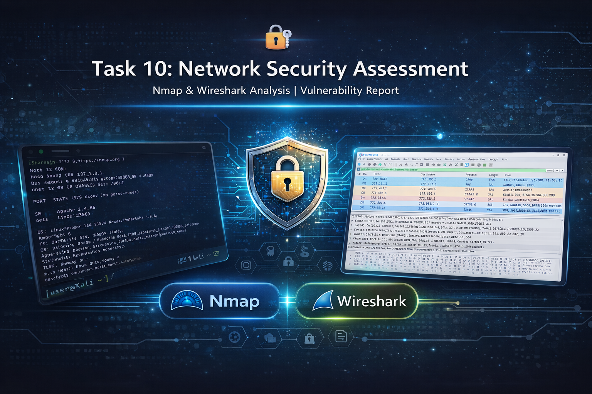

<p align="center">
  
</p>

<h1 align="center">🛡️ Cybersecurity Internship Project – Oasis Infobyte</h1>

<p align="center"><b>Offensive Security | Vulnerability Assessment | Network Analysis</b></p>

<p align="center">
  
  
  
  
  
</p>

---

## 📌 Project Overview

<p align="justify">
This repository showcases a <b>comprehensive cybersecurity internship project</b> involving real-world security testing techniques.  
The project focuses on identifying, analyzing, and exploiting vulnerabilities using industry-standard tools and methodologies.
</p>

---

## 🎯 Objectives

* Perform **Web Application Security Testing**
* Conduct **Vulnerability Scanning**
* Analyze **Network Traffic**
* Build a **Professional Security Assessment Report**

---

## 🧰 Tools & Technologies

| Tool       | Purpose                              |
| ---------- | ------------------------------------ |
| Nmap       | Network scanning & service detection |
| Wireshark  | Network traffic analysis             |
| Nikto      | Web vulnerability scanning           |
| DVWA       | Vulnerable web application           |
| XAMPP      | Local server environment             |
| Kali Linux | Security testing platform            |
| VS Code    | Development & documentation          |

---

# 🚀 Project Tasks

---

## 🔓 Task 3: SQL Injection (Core Skill)

<p align="center">
  
</p>

### 📌 Description

Performed SQL Injection attacks on DVWA to exploit improper input validation.

### 🔍 Key Outcomes

* Bypassed authentication
* Extracted database information
* Demonstrated real-world vulnerability

👉 [View Full Task](Task-3-SQL-Injection/README.md)

---

## 🛡 Task 7: Vulnerability Scanning with Nikto

<p align="center">
  
</p>

### 📌 Description

Conducted web server vulnerability assessment using Nikto.

### 🔍 Key Findings

* Missing security headers
* Outdated software
* Directory indexing issues

👉 [View Full Task](Task-7-Nikto/README.md)

---

## 🦈 Task 8: Network Traffic Analysis (Wireshark)

<p align="center">
  
</p>

### 📌 Description

Captured and analyzed network traffic using Wireshark.

### 🔍 Key Insights

* DNS queries and TCP handshake
* TLS encrypted communication
* HTTP vs HTTPS behavior

👉 [View Full Task](Task-8-Wireshark/README.md)

---

## 🔐 Task 10: Network Security Assessment Report

<p align="center">
  
</p>

### 📌 Description

Performed full network security assessment using Nmap & Wireshark.

### 🔍 Key Findings

* Open ports (HTTP, SMB, MySQL)
* Exposure of critical services
* Unencrypted communication risks

👉 [View Full Report](Task-10-Security-Report/README.md)

---

# 📊 Key Skills Demonstrated

* 🔥 Penetration Testing
* 🔥 Vulnerability Assessment
* 🔥 Network Analysis
* 🔥 Security Reporting
* 🔥 Risk Assessment

---

# 🧠 Learning Outcomes

* Understanding of **real-world attack vectors**
* Hands-on experience with **security tools**
* Ability to analyze and interpret **network traffic**
* Writing **professional security reports**

---

# 📁 Repository Structure

```bash
Cybersecurity-Internship-Oasis-Infobyte/
│
├── Task-3-SQL-Injection/
├── Task-7-Nikto/
├── Task-8-Wireshark/
└── Task-10-Security-Report/
```

---

# 🏁 Conclusion

<p align="justify">
This project demonstrates a complete workflow of identifying vulnerabilities, analyzing network behavior, and documenting findings professionally.  
It reflects practical cybersecurity skills aligned with real-world industry requirements.
</p>

---

# ⚠ Disclaimer

This project was conducted in a controlled lab environment for educational purposes only.

---

# 👨‍💻 Author

**Avijit Baidya**
