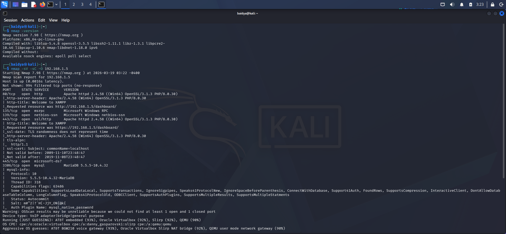
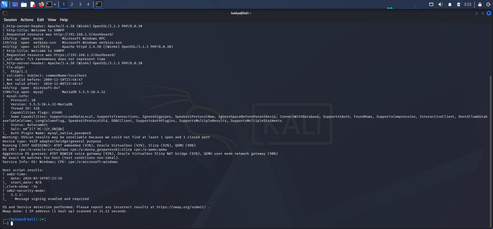
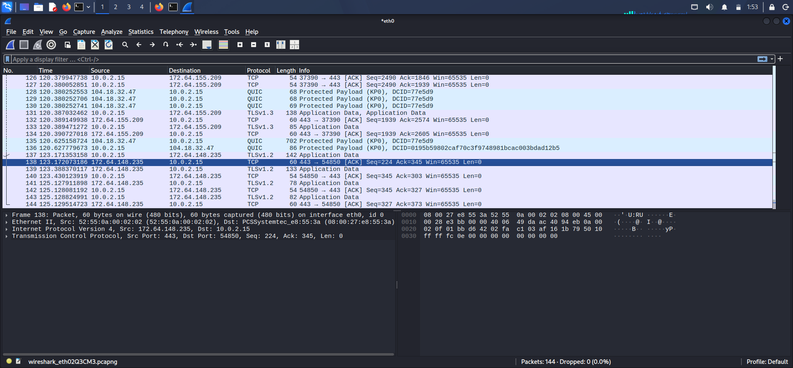

# 🔐 Network Security Assessment Report

<p align="center">
  <b>Comprehensive Network Security Analysis using Nmap & Wireshark</b>
</p>

---

## 👨‍💻 Author

**Avijit Baidya**

---

## 📌 Executive Summary

This report presents a **detailed network security assessment** conducted on a local lab environment hosting DVWA on XAMPP.

The assessment combines:

* 🔍 **Active scanning (Nmap)**
* 📡 **Passive traffic analysis (Wireshark)**

The findings reveal **multiple exposed services, legacy protocols, and potential attack surfaces**, highlighting critical security risks.

---

## 🎯 Scope of Assessment

* Target IP: `192.168.1.5`
* Environment: Localhost (XAMPP + DVWA)
* Tools Used:

  * Nmap
  * Wireshark

---

## 🛠 Methodology

### 1️⃣ Network Scanning (Nmap)

Command used:

```bash id="ny2tno"
nmap -sV -sC -O 192.168.1.5 -oN nmap_results.txt
```

---

### 2️⃣ Traffic Analysis (Wireshark)

* Captured live network packets
* Applied filters:

  * DNS
  * TCP
  * TLS
  * HTTP

---

## 🔍 Nmap Scan Evidence

<p align="center">
  
  
</p>

<p align="center">
  <i>Figure: Nmap scan results showing open ports (80 - HTTP, 3306 - MySQL) and service detection</i>
</p>

### 🟢 Open Ports & Services

| Port | Service | Version               | Risk      |
| ---- | ------- | --------------------- | --------- |
| 80   | HTTP    | Apache 2.4.58 (XAMPP) | 🔴 High   |
| 135  | MSRPC   | Microsoft RPC         | 🟠 Medium |
| 139  | NetBIOS | Windows NetBIOS       | 🔴 High   |
| 443  | HTTPS   | Apache SSL            | 🟡 Low    |
| 445  | SMB     | Microsoft-DS          | 🔴 High   |
| 3306 | MySQL   | MariaDB               | 🔴 High   |

---

## 🚨 Critical Findings

### 🔴 1. SMB (Port 445) Exposure

* Allows file sharing access
* Common target for attacks (e.g., WannaCry)
* Can lead to **remote code execution**

---

### 🔴 2. NetBIOS (Port 139)

* Legacy protocol
* Vulnerable to enumeration attacks
* Can expose system information

---

### 🔴 3. MySQL Database Exposure (Port 3306)

* Database directly accessible
* Risk of unauthorized access
* Potential data leakage

---

### 🔴 4. HTTP Service (Port 80)

* Unencrypted communication
* Vulnerable to:

  * Sniffing
  * Man-in-the-Middle attacks

---

### 🟡 5. HTTPS Configuration Issues

* Self-signed certificate detected
* Not trusted → vulnerable to spoofing

---

### 🟠 6. MSRPC Service (Port 135)

* Used for Windows communication
* Can be exploited for lateral movement

---

## 📡 Wireshark Traffic Analysis

<p align="center">
  
</p>

<p align="center">
  <i>Figure: Network traffic capture showing DNS queries, TCP communication, and encrypted TLS/QUIC packets</i>
</p>

### Observed Traffic

* DNS queries for domain resolution
* TCP handshake sequences
* QUIC protocol traffic
* TLS encrypted communication
* HTTP/DVWA traffic

---

### 🔍 Key Observations

#### 🔴 Unencrypted Traffic (DVWA)

* Data transmitted via HTTP
* Fully visible in packet capture

---

#### 🔒 Encrypted Traffic (External)

* TLS 1.3 + QUIC used
* Payload encrypted → secure communication

---

#### 🌐 DNS Activity

* Domain resolution visible
* Can be used for traffic profiling

---

## 📊 Risk Assessment

| Vulnerability            | Severity    |
| ------------------------ | ----------- |
| SMB Exposure (445)       | 🔴 Critical |
| NetBIOS Exposure (139)   | 🔴 High     |
| MySQL Exposure (3306)    | 🔴 High     |
| HTTP (No Encryption)     | 🔴 High     |
| MSRPC Service            | 🟠 Medium   |
| Weak HTTPS (Self-signed) | 🟡 Low      |

---

## 🛡 Recommendations

### 🔐 Network Security

* Disable SMB & NetBIOS if not required
* Restrict port 3306 (MySQL) access
* Use firewall rules

---

### 🌐 Web Security

* Enforce HTTPS (valid SSL certificate)
* Disable HTTP access

---

### ⚙️ System Hardening

* Update Apache, PHP, OpenSSL
* Disable unused services
* Apply security patches

---

### 📡 Monitoring

* Use IDS/IPS systems
* Monitor network traffic continuously

---

## 📁 Deliverables

* `network_security_assessment.md`
* `nmap_results.txt`
* `wireshark_capture.pcap`

---

## 🎥 Demo Idea

* Perform Nmap scan
* Capture packets in Wireshark
* Filter HTTP and TLS traffic
* Explain vulnerabilities

---

## 🏁 Conclusion

The assessment highlights that **misconfigured services and exposed ports significantly increase attack surface**.

This project demonstrates:

* Importance of port management
* Need for encryption
* Value of network monitoring

---

## ⚠ Disclaimer

This assessment was conducted in a controlled lab environment for educational purposes only.
