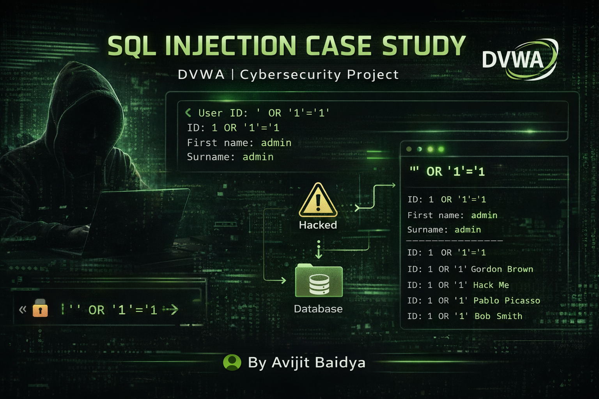
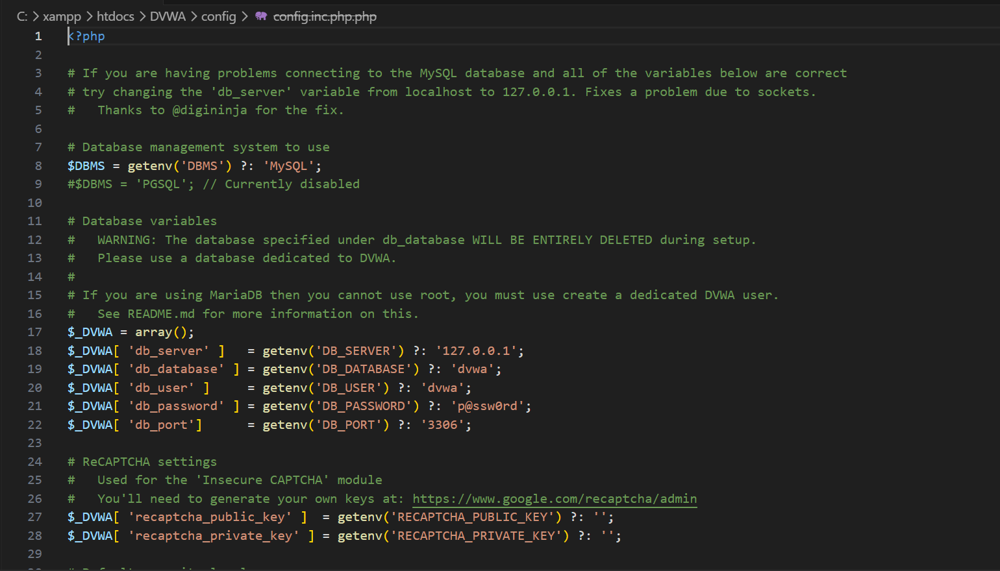
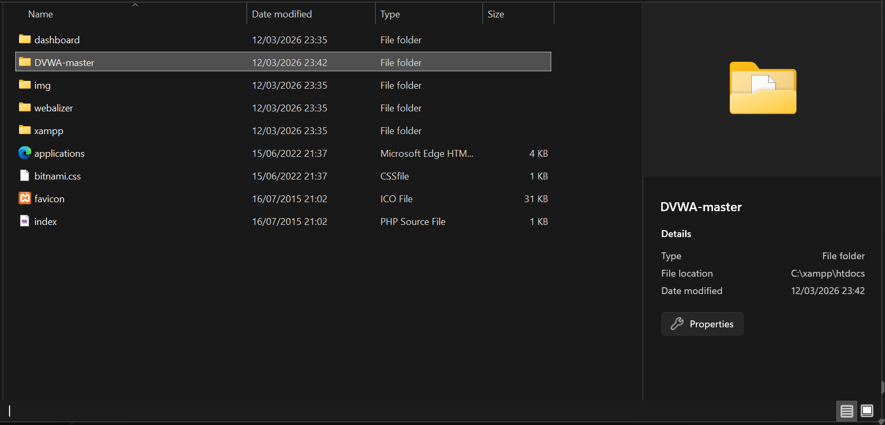
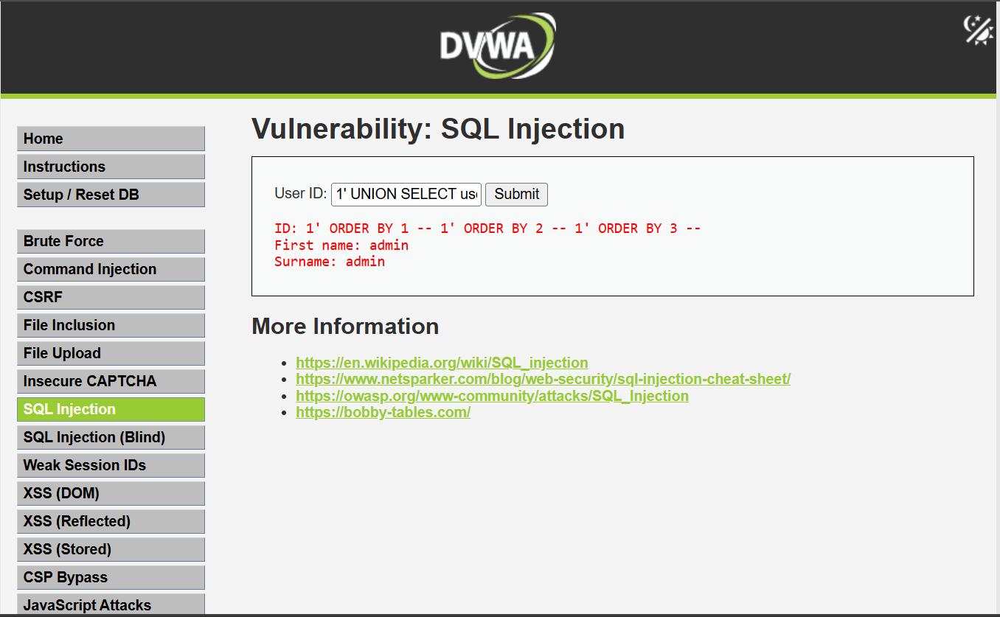
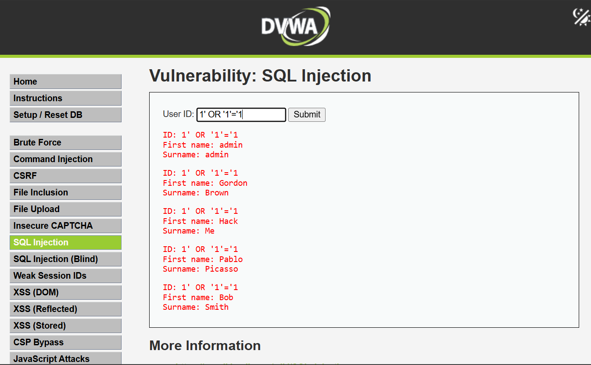
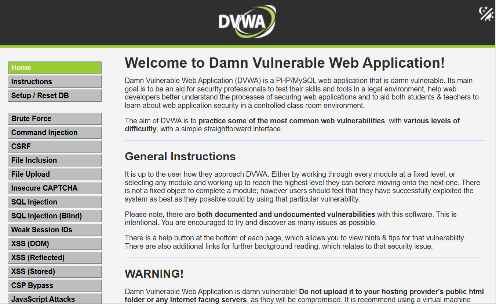
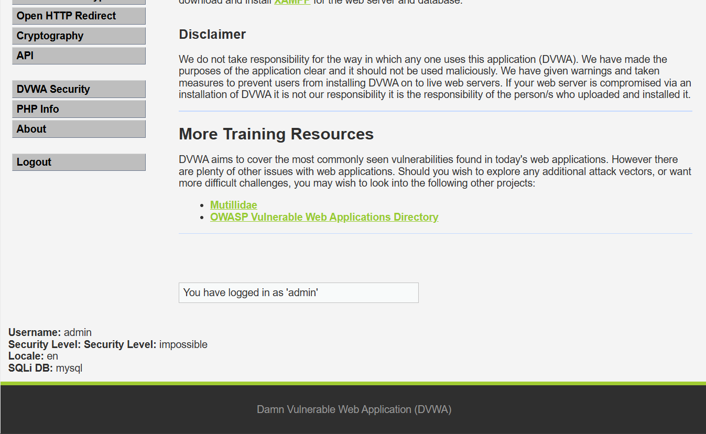

<p align="center">
  
</p>

<h1 align="center">🔐 SQL Injection Case Study using DVWA</h1>

<p align="center">
 
 
 
 
 
</p>

---

## 👨‍💻 Author

**Avijit Baidya**

---

## 📖 Executive Summary

This project presents a **practical exploitation of SQL Injection vulnerability** in a controlled environment using DVWA.

The assessment demonstrates how improper input validation allows an attacker to:

* Manipulate backend SQL queries
* Retrieve sensitive user data
* Bypass application logic

📌 This simulates a **real-world web application security failure scenario**.

---

## 🎯 Objectives

* Identify SQL Injection vulnerability
* Perform column enumeration
* Execute injection payload
* Extract database records
* Analyze security impact

---

## 🛠 Tools & Environment

| Tool       | Purpose                       |
| ---------- | ----------------------------- |
| DVWA       | Vulnerable web application    |
| XAMPP      | Local server (Apache + MySQL) |
| phpMyAdmin | Database management           |
| VS Code    | Documentation                 |
| Browser    | Testing interface             |

---

## ⚙️ Environment Setup

### Step 1: Configure DVWA

📸


* Verified database credentials
* Connected DVWA to MySQL

---

### Step 2: Deployment Location

📸


* DVWA hosted inside XAMPP `htdocs`

---

### Step 3: Application Access

📸


* Default credentials used for access

---

## 🔍 Vulnerability Analysis

### 🧪 Step 4: Column Enumeration

To understand the backend query structure:

```sql id="dplk0m"
1' ORDER BY 1 --
1' ORDER BY 2 --
1' ORDER BY 3 --
```

📸


🔎 **Insight:**
Helps determine number of columns in the SQL query → required for advanced exploitation.

---

### 💉 Step 5: SQL Injection Execution

Payload used:

```sql id="g7q2l1"
' OR '1'='1
```

📸


---

### 💥 Step 6: Exploitation Result

The application returned multiple records:

* admin
* Gordon Brown
* Hack Me
* Pablo Picasso
* Bob Smith

🔎 **Analysis:**

* Input bypassed WHERE condition
* Query returned all database entries
* No input sanitization present

---

## ⚠️ Evidence Clarification

The following screenshots represent **normal application behavior**, not attack results:

📸


📸


✔ These show:

* Successful login dashboard
* Not part of SQL Injection exploitation

---

## 🧑‍💻 Database Interaction

📸


* User created via phpMyAdmin
* Confirms backend database control

---

## 🔬 Technical Breakdown

### Original Query

```sql id="zql9nx"
SELECT * FROM users WHERE id = 'INPUT';
```

### Exploited Query

```sql id="7v3i9m"
SELECT * FROM users WHERE id = '' OR '1'='1';
```

📌 **Result:** Condition always TRUE → returns all rows

---

## 📊 Vulnerability Assessment

| Metric             | Severity    |
| ------------------ | ----------- |
| CVSS Level         | 🔥 Critical |
| Exploit Difficulty | Low         |
| Impact             | High        |
| Risk Level         | Severe      |

---

## 🔁 Attack Flow

```id="8ivn3c"
User Input → Injection Payload → SQL Query Manipulation → Database Execution → Data Exposure
```

---

## 🛡 Mitigation Strategies

* Use Prepared Statements (Parameterized Queries)
* Implement Input Validation & Sanitization
* Apply Least Privilege Principle
* Use Web Application Firewall (WAF)
* Disable verbose error messages

---

## 🌍 Real-World Impact

If exploited in production systems, this vulnerability can lead to:

* Unauthorized data access
* Credential leakage
* Full database compromise
* Privilege escalation

---

## 📁 Project Structure

```id="h9xq2r"
Task-3-SQL-Injection/
│
├── screenshots/
│   ├── attacking-number-of-columns.png
│   ├── config-inc-php.png
│   ├── dvwa-file.png
│   ├── dvwa-login-page.png
│   ├── SQL-Injection.png
│   ├── Successfully-Login-1.png
│   ├── Successfully-Login-2.png
│   └── User-ID-Creation.png
│
└── README.md
```

---

## 🧠 Key Learnings

* SQL Injection remains one of the most critical web vulnerabilities
* Lack of input validation leads to complete system compromise
* Even basic payloads can expose entire databases
* Secure coding practices are essential

---

## 💼 Resume Highlight

> Conducted SQL Injection testing on DVWA by performing column enumeration and exploiting authentication logic, resulting in full database record extraction and vulnerability impact assessment.

---

## 🔗 References

* https://owasp.org/www-community/attacks/SQL_Injection
* https://portswigger.net/web-security/sql-injection
* https://en.wikipedia.org/wiki/SQL_injection

---

## ⭐ Final Thoughts

This case study demonstrates how a simple vulnerability can escalate into a **critical security breach**, reinforcing the need for secure development and proper input handling.

---
