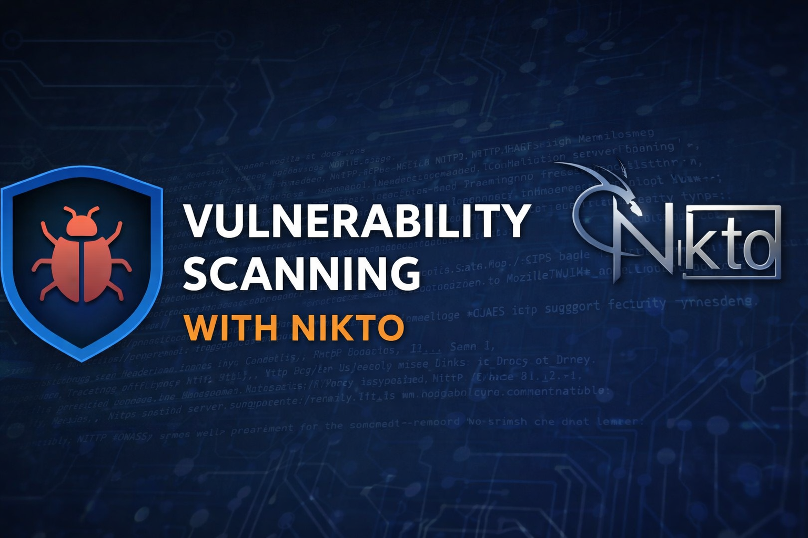
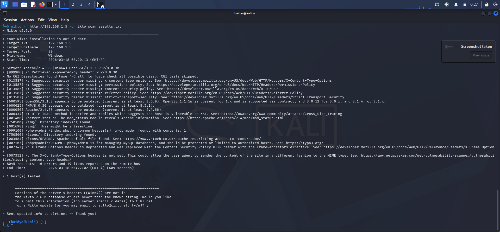

# 🔐 Web Server Vulnerability Assessment using Nikto

<p align="center">
  
</p>

---

## 👨‍💻 Author
**Avijit Baidya**

---

## 📖 Project Overview

This project demonstrates a **real-world web server vulnerability assessment** performed using **Nikto** against a locally hosted **DVWA (Damn Vulnerable Web Application)** environment.

The objective is to identify:
- Misconfigurations
- Outdated software components
- Security weaknesses
- Potential attack vectors

---

## 🎯 Objectives

- Perform automated vulnerability scanning using Nikto
- Identify security misconfigurations in a web server
- Analyze real scan results
- Document findings in a professional security report format

---

## 🛠 Tools & Environment

| Tool            | Purpose                          |
|-----------------|----------------------------------|
| Kali Linux      | Attack machine                   |
| Nikto v2.6.0    | Web vulnerability scanner        |
| DVWA            | Vulnerable target application    |
| XAMPP           | Hosting Apache & PHP             |
| VS Code         | Documentation & version control  |
| GitHub          | Project repository               |

---

## 🌐 Target Details

- **Target IP:** 192.168.1.5  
- **Protocol:** HTTP  
- **Port:** 80  
- **Web Server:** Apache/2.4.58 (Win64)  
- **Backend:** PHP 8.0.30  
- **SSL Library:** OpenSSL 3.1.3  

---

## ⚡ Scan Execution

### Command Used:

```bash
nikto -h http://192.168.1.5 -o nikto_scan_results.txt
```

### Scan Summary:
- Total Requests: 8000+  
- Vulnerabilities Identified: Multiple  
- Target Platform: Windows (Apache)

---

## 📸 Scan Evidence

### 🔹 Nikto Scan Output


---

## 🔍 Detailed Findings

### 🚨 1. Missing Security Headers

The application lacks critical HTTP security headers:
- Content-Security-Policy (CSP)
- X-Content-Type-Options
- Strict-Transport-Security (HSTS)
- Referrer-Policy
- Permissions-Policy

🔴 **Risk:**
- Cross-Site Scripting (XSS)
- Data leakage
- Content sniffing attacks

---

### 🚨 2. Outdated Software Components

| Component | Version | Status |
|----------|--------|--------|
| Apache   | 2.4.58 | Outdated |
| PHP      | 8.0.30 | Outdated |
| OpenSSL  | 3.1.3  | Outdated |

🔴 **Risk:**
- Known vulnerabilities exploitable
- Remote Code Execution (RCE)

---

### 🚨 3. HTTP TRACE Method Enabled

- TRACE method is active on the server

🔴 **Risk:**
- Vulnerable to **Cross-Site Tracing (XST)** attacks

---

### 🚨 4. Directory Indexing Enabled

Accessible directories:
- `/img/`
- `/icons/`

🔴 **Risk:**
- Sensitive file exposure
- Internal structure disclosure

---

### 🚨 5. Information Disclosure

Exposed endpoints:
- `/server-status`
- `/phpmyadmin/`
- Apache default files

🔴 **Risk:**
- Attack surface expansion
- Potential database compromise

---

## 📊 Risk Summary

| Vulnerability Type        | Severity |
|--------------------------|---------|
| Missing Security Headers | High    |
| Outdated Software        | High    |
| Information Disclosure   | High    |
| HTTP TRACE Enabled       | Medium  |
| Directory Indexing       | Medium  |

---

## 🛡 Security Recommendations

- Disable HTTP TRACE method
- Implement strong security headers (CSP, HSTS, etc.)
- Disable directory listing on server
- Restrict access to `/phpmyadmin`
- Disable or protect `/server-status`
- Regularly update Apache, PHP, and OpenSSL

---

## 📁 Project Structure

```
Task-7-Nikto/
│
├── screenshots/
│   └── nikto-scan.png
│
├── nikto_scan_results.txt
└── README.md
```

---

## 📚 Key Learning Outcomes

- Practical usage of Nikto scanner
- Understanding web server vulnerabilities
- Real-world vulnerability analysis
- Professional cybersecurity documentation

---

## ⚠ Disclaimer

This project was conducted in a **controlled lab environment (DVWA)** strictly for educational purposes.  
No unauthorized systems were targeted.

---

## ⭐ Conclusion

The Nikto scan highlights several **critical security weaknesses** in the web server configuration.  
This demonstrates how improper configurations and outdated components can significantly increase the risk of exploitation in real-world systems.