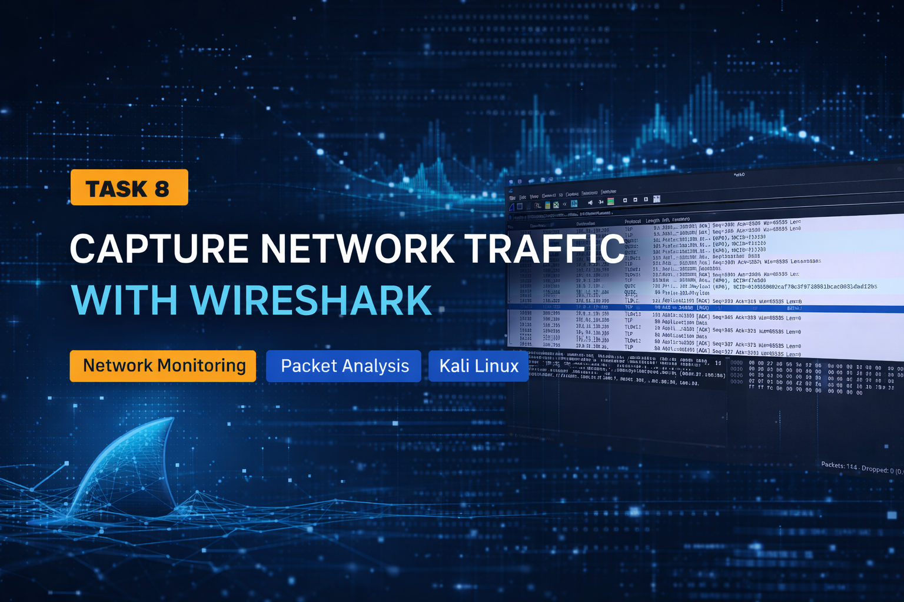
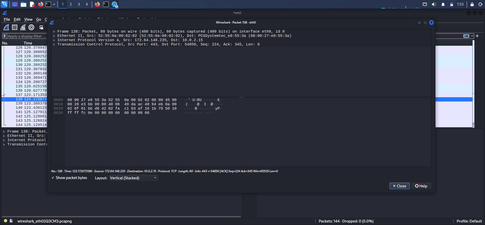

<h1 align="center">🦈 Capture & Analyze Network Traffic with Wireshark</h1>
<br>
<p align="center"><b>Network Traffic Analysis | DVWA Lab | Kali Linux</b></p>

<p align="center">
  
  
  
  
  
  
</p>

---

## 📌 Executive Summary

This project presents a **comprehensive real-world network traffic analysis** using **Wireshark** in a controlled cybersecurity lab environment.

The analysis includes both:

* 🌐 **Insecure web traffic (DVWA over HTTP via XAMPP)**
* 🔒 **Secure communication (HTTPS, TLS 1.3, QUIC)**

This case study demonstrates how data flows across networks, how secure channels are established, and how attackers or analysts interpret packet-level information.

---

## 🎯 Objectives

* Capture live network traffic using Wireshark
* Analyze DNS, HTTP, TCP, TLS, and QUIC protocols
* Understand plaintext vs encrypted communication
* Perform packet-level inspection and interpretation
* Simulate real-world network monitoring scenarios

---

## 🛠 Tools & Technologies

* **Wireshark** – Network protocol analyzer
* **DVWA (Damn Vulnerable Web Application)** – Vulnerable test platform
* **XAMPP** – Local Apache & MySQL server
* **Kali Linux** – Security analysis environment
* **VS Code** – Documentation and workflow management
* **Web Browser** – Traffic generation

---

## 🌐 Network Environment

| Component          | Value                     |
| ------------------ | ------------------------- |
| Attacker Machine   | 10.0.2.15                 |
| Gateway            | 192.168.1.1               |
| Local Server       | XAMPP (Apache)            |
| Web Application    | DVWA                      |
| External Domain    | chatgpt.com               |
| Protocols Observed | DNS, HTTP, TCP, TLS, QUIC |

---

## 📸 Capture Evidence


---

## 🔍 Packet Analysis

### 1️⃣ DNS Resolution

* Queries sent to DNS server (`192.168.1.1`)
* Domain resolved into:

  * `104.18.32.47`
  * `172.64.155.209`

📌 **Insight:**
DNS reveals metadata such as visited domains even in encrypted environments.

---

### 2️⃣ HTTP Traffic (DVWA – Vulnerable Environment)

* DVWA hosted on XAMPP uses **HTTP (plaintext)**
* Requests and responses are visible

📌 **Insight:**
Sensitive data like login credentials can be intercepted → **critical vulnerability**

---

### 3️⃣ TCP Handshake

* SYN → SYN-ACK → ACK

📌 **Insight:**
Ensures reliable connection establishment before data transfer.

---

### 4️⃣ TLS 1.3 Encryption

* Client Hello
* Server Hello
* Encrypted Application Data

📌 **Insight:**
After handshake, payload becomes unreadable → protects sensitive data.

---

### 5️⃣ QUIC Protocol (HTTP/3)

* Runs over UDP
* Includes Initial + Protected Payload packets

📌 **Insight:**
Improves speed and performance but limits packet inspection.

---

## 🔬 Deep Packet Inspection (Advanced)



This view exposes:

* Ethernet Frame
* IP Header
* TCP Segment
* Raw Hexadecimal Data

📌 **Insight:**
Used in advanced forensic analysis and low-level debugging.

---

## 🔐 Security Analysis

* 🔓 HTTP traffic exposes sensitive data (DVWA)
* 🔒 HTTPS traffic is encrypted using TLS 1.3
* 🌐 DNS leaks domain-level metadata
* ⚡ QUIC reduces visibility for deep inspection
* 👁️ Attackers exploit insecure HTTP endpoints

---

## ⚠️ Key Observations

* Plain HTTP is **highly insecure**
* Modern systems rely heavily on encryption
* Encrypted traffic hides payload but not metadata
* Network analysis still provides valuable intelligence

---

## 📁 Project Structure

Task-8-Wireshark/
│── screenshots/
│   ├── banner.png
│   ├── wireshark-capture.png
│   └── wireshark-packet-detail.png
│
│── wireshark_capture.pcapng
│── README.md

---

## 🎥 Demonstration Workflow

1. Start XAMPP (Apache & MySQL)
2. Launch DVWA in browser
3. Start Wireshark capture (`eth0`)
4. Perform actions (login, browsing, requests)
5. Apply filters:

   ```
   http
   dns
   tcp
   tls
   quic
   ```
6. Analyze packets
7. Save `.pcapng` file

---

## 🚀 Key Learning Outcomes

* Hands-on packet sniffing and traffic analysis
* Understanding of modern network protocols
* Ability to analyze secure vs insecure communication
* Real-world cybersecurity monitoring skills
* Practical exposure to vulnerable web environments

---

## 🏁 Conclusion

This project demonstrates how network traffic behaves across both **secure (HTTPS)** and **insecure (HTTP)** environments.

By integrating **DVWA, XAMPP, and Wireshark**, it provides a realistic simulation of:

* Network monitoring
* Traffic interception
* Security analysis

It highlights the importance of:

* Secure communication (HTTPS)
* Proper server configuration
* Continuous network monitoring

---

## 👨‍💻 Author

**Avijit Baidya**
Cybersecurity Enthusiast | Aspiring Security Engineer 🚀
